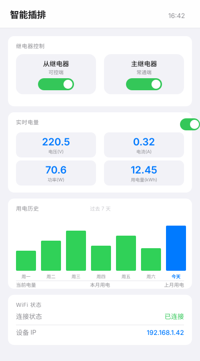
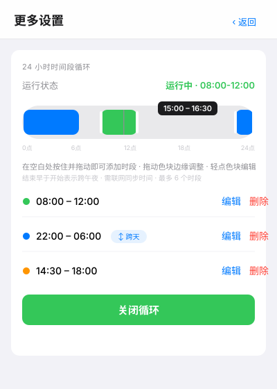
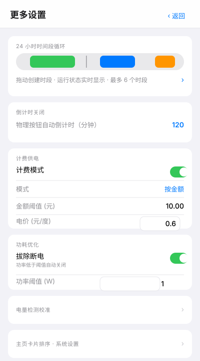
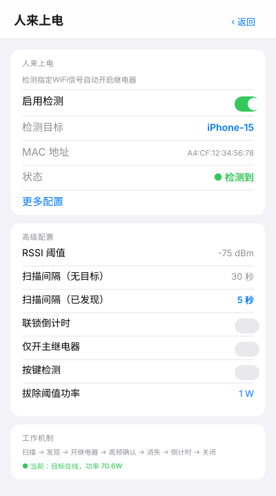
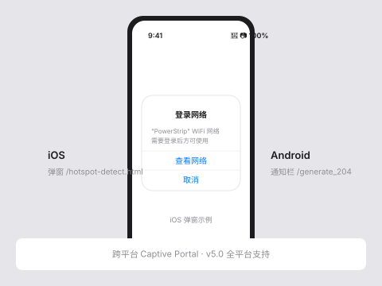

<div align="center">

# 🔌 智能插排固件

### ESP8266 Smart Power Strip Firmware · v5.5


**基于 ESP8266 (ESP-12E/F) 的智能插排固件** · 远程控制 / 电能计量 / 人来上电 / 计费供电 / Captive Portal

[](#)
[](#)
[](#)
[](#)
[](#)

</div>

---

## 🌟 项目亮点

| 亮点 | 说明 |
|------|------|
| ⚡ **零阻塞状态机** | SY7T609 电能芯片读取采用状态机驱动，主循环永不阻塞（v5.0 重构） |
| 📱 **跨平台门户** | Captive Portal 支持 iOS / Android / Windows / macOS 自动弹窗 |
| 👋 **人来上电** | 检测指定 WiFi 设备信号自动通电，离开自动断电 |
| 💰 **计费供电** | 按电量/金额/时长三种模式，内置电价设置 |
| 📊 **电能可视化** | 实时 V/A/W/PF + 7 日柱状图 + 月度对比 |
| 🔄 **OTA 升级** | 支持 Arduino OTA / Web OTA 双通道，无需 USB |
| 🏠 **mDNS 域名** | 局域网 `power.local` 直达，免记 IP |

---

## 🖼️ 界面预览

| 主页控制 | 24 小时循环（v5.1 时间轴） |
| :---: | :---: |
|  |  |
| 继电器控制 / 实时电量 / 用电历史 | 拖动创建 / 跨天反向 / 运行状态 |

| 更多设置 | 人来上电配置 |
| :---: | :---: |
|  |  |
| 功能卡片在前 / 维护卡片靠后 | 目标选择 / 高级参数 / 工作机制 |

| Captive Portal 跨平台门户 |
| :---: |
|  |
| iOS / Android / Windows / macOS 自动弹窗 |

## 功能特性

### 继电器控制
- **主继电器（总控）**：控制插座主体电源
- **从继电器（分控）**：独立控制的输出端
- **批量控制**：支持同时开关双继电器
- **锁定模式**：禁用物理按键，仅 Web 端可控

### 电能监测 (SY7T609)
- 实时电压、电流、功率、功率因数显示
- 累计用电量统计（kWh）
- 月度/上月用电对比
- 7天用电历史记录
- **状态机驱动非阻塞读取**（v5.0）：主循环零阻塞，单项故障不阻塞整体轮询
- 电压/电流自动校准、恢复出厂校准、清零电能

### 智能功能
- **倒计时关闭**：选择时长后自动关闭继电器
- **24小时循环**：可视化 24 小时时间轴，最多 6 个时段，支持拖拽创建/调整、跨午夜时段及一键反向选择（v5.1）
- **功耗优化（含拔除断电保护）**：功率低于阈值时自动关闭（v5.0 合并卡片）
- **计费供电**：支持按电量/金额/时长阈值关闭，内置电价设置（v5.0 迁入）
- **人来上电**：检测指定WiFi信号自动开启，支持：
  - 信号消失联锁倒计时
  - 仅开主继电器模式
  - 按键检测（锁定模式下物理按键触发单次扫描）
- **MQTT 集成**：支持接入 Home Assistant 等智能家居平台

### 网络功能
- **mDNS 域名**：默认 `power.local`，支持自定义
  - v5.0 可靠性提升：`MDNS.begin()` 失败重试 3 次，`MDNS.update()` 独立于 STA 状态调用，Web 请求间隙兜底响应
- **Captive Portal**：跨平台门户弹出（v5.0 新增 Android `/generate_204`、Windows `/connecttest.txt` 探测端点）
- **页面 gzip 交付**（v5.2）：Web 页面预压缩为 gzip，Flash 占用降低约 8%，AP 直连首屏加载提速 3-4 倍
- **AP + STA 双模式**：配置时不断开连接
- **Web OTA 升级**：支持网页上传固件升级
- **远程崩溃取证**（v5.3）：崩溃寄存器现场自动存 RTC，`/api/crashdump` 读取——设备装在墙上不用拆机也能定位崩溃，见「踩坑实录」
- **加载动画超时保护**（v5.0）：fetch 5 秒超时 + 3 秒保底重试，避免页面卡在加载状态

### 其他
- WiFi 断线红灯告警（可关闭）
- 卡片排序和显示控制
- 物理按键单击/双击/长按支持

## 硬件要求

### 推荐硬件
- ESP-12E 或 ESP-12F 模块
- SY7T609 电能监测芯片
- 双路锁存继电器模块（总控+分控）
- 蓝色、红色、白色 LED 各一个
- 物理按键一个

### GPIO 分配

| GPIO | 功能 | 说明 |
|------|------|------|
| 0 | RELAY_MASTER_PIN | 总控继电器（兼 Flash Boot 检测）|
| 1 | UART_TX | SY7T609 通信（GPIO1）|
| 3 | UART_RX | SY7T609 通信（GPIO3）|
| 4 | BUTTON_PIN | 物理按键 |
| 5 | LED_WHITE_PIN | 从继电器指示灯 |
| 12 | RELAY_SLAVE_PIN | 分控继电器 |
| 14 | LED_RED_PIN | 红色 LED（WiFi 状态）|
| 15 | RELAY_ENABLE_PIN | 继电器锁存使能 |
| 16 | LED_BLUE_PIN | 蓝色 LED（通用指示）|

## 编译与刷入

### 环境要求
- [PlatformIO Core](https://docs.platformio.org/en/latest/core/) 或 VS Code + PlatformIO 插件
- Python 3.8+

### 编译固件
```bash
# 克隆项目
git clone https://github.com/S0DX/esp8266-powerstrip.git
cd esp8266-powerstrip

# 安装依赖
pio pkg install

# 编译
pio run -e esp12e
```

### 刷入固件

#### 首次刷入（USB）
```bash
# 修改 platformio.ini 中的 upload_port 为你的串口
pio run -e esp12e -t upload
```

#### OTA 升级（WiFi）
局域网内任意位置均可升级，无需 USB 连接：
```bash
# 确保设备已联网，upload_port 改为设备 IP
pio run -e esp12e-ota -t upload --upload-port 192.168.1.100
```

#### Web OTA（推荐）

Web OTA 适合无命令行环境（如手机、临时电脑），操作步骤：

1. 设备连接 WiFi 后，访问 `http://power.local/` 或设备 IP
2. 进入"更多设置"页面，滚动到底部找到 **Web 固件升级** 卡片
3. 点击"选择固件"按钮，选取 `.pio/build/esp12e/firmware.bin` 文件
4. 点击"开始升级"，等待 1-2 分钟完成（期间切勿断电）
5. 升级完成后设备自动重启，新版本生效

#### OTA 密码

| 方式 | 密码 | 用途 |
|------|------|------|
| Arduino OTA（命令行 / PlatformIO） | `ota_password` | 局域网命令行固件推送 |
| Web OTA（网页上传） | `admin` | Web 界面固件上传 |
| mDNS 名称 | `power.local` | OTA 主机名（可在设置中修改） |

#### OTA 安全提示

- **务必保证电源稳定**：OTA 升级期间（~90 秒）不可断电，否则可能变砖需 USB 救砖
- **保留原固件备份**：升级前保留 `.pio/build/esp12e/firmware.bin` 旧版本
- **升级失败处理**：如设备卡在重启循环，连接 USB 重新刷入固件

#### 修改 OTA 密码

编辑 `src/ota_mgr.cpp` 中的 `OTAManager::init()`：

```cpp
ArduinoOTA.setPassword("ota_password");  // Arduino OTA 密码
// Web OTA 密码见 WebConfigServer::setup()
```

### Captive Portal 跨平台门户

首次上电未联网时，设备创建 AP，连接后自动弹出配置门户——无需手动输入 IP。v5.0 已支持全平台：

| 平台 | 探测端点 | 行为 |
|------|---------|------|
| iOS | `/hotspot-detect.html` | 弹出"登录网络"对话框 |
| Android | `/generate_204`、`/gen_204` | 通知栏提示"此网络需要登录" |
| Windows | `/connecttest.txt`、`/redirect` | 浏览器自动打开配置页 |
| macOS | `/hotspot-detect.html` | 弹窗（同 iOS） |

**触发条件**：
- 设备未连接任何 WiFi（首次配置或 STA 失败）
- AP 模式开启（默认 `PowerStrip` 或 `PowerStrip-N`）

**未弹出门户的手动访问**：浏览器地址栏输入 `http://192.168.4.1/` 或 `http://power.local/`。

## 使用说明

### 初始配置

1. 首次上电，设备创建 AP `PowerStrip`（或 `PowerStrip-N`，无密码）
2. 连接后自动弹出配置门户（支持 iOS/Android/Windows）；或访问 `http://192.168.4.1`
3. 在"WiFi 状态"卡片中点击"连接 WiFi"配置网络
4. 连接成功后，设备 IP 会显示在界面上，也可通过 `power.local` 访问

### Web 界面功能

#### 继电器控制卡片
| 开关 | 作用 |
|------|------|
| 主继电器 | 控制总控电源 |
| 从继电器 | 控制分控电源 |
| 锁定模式 | 禁用物理按键 |

#### 实时电量卡片
- 电压、电流、功率、用电量实时显示
- 开关：启用/禁用电量检测

#### 用电历史卡片
- 7 天柱状图
- 底部三项数据（v5.0）：当前电量 / 本月用电 / 上月用电

#### 人来上电卡片
| 设置 | 作用 |
|------|------|
| 启用检测 | 开启 WiFi 信号检测 |
| 检测目标 | 选择要检测的 WiFi 名称 |
| 更多配置 | 按键检测、联锁倒计时、仅开主继电器、检测设置 |

##### 人来上电功能详解

**核心用途**：检测到指定手机/设备的 WiFi 信号（手机连接过家庭 WiFi 后会主动探测），自动开启继电器；人离开（信号消失）后自动关闭，实现"人到电通、人走电断"。

**典型场景**：
- 家中手机/平板检测：回家自动开灯开电器
- 办公室工位检测：坐下自动给电脑供电
- 智能家居联动：作为"人在家"信号触发其他设备

**启用步骤**：
1. 主页面"人来上电"卡片点击「选择WiFi」按钮
2. 从扫描结果中选择目标设备（手机、平板、IoT 设备）
3. 卡片显示目标名称和 MAC 地址
4. 点击「更多配置」调整参数后保存

**高级配置**（更多配置页）：

| 参数 | 默认值 | 说明 |
|------|--------|------|
| RSSI 阈值 | -75 dBm | 信号强度低于此值视为无人。建议 -80 ~ -70 |
| 扫描间隔（无目标） | 30 秒 | 未发现目标时的扫描周期，省电 |
| 扫描间隔（已发现） | 5 秒 | 已发现目标时高频确认，防止误判 |
| 联锁倒计时 | 关闭 | 信号消失后等待 N 秒再断电（避免瞬时信号波动） |
| 仅开主继电器 | 关闭 | 开启后只触发主继电器，从继电器保持关闭 |
| 按键检测 | 关闭 | 锁定模式下单击物理按钮触发单次扫描（适合 IoT 设备） |
| 拔除阈值功率 | 1W | 检测到目标但功率持续低于此值（拔除），自动关闭 |

**工作机制**：
```
周期扫描 → 发现目标 RSSI > 阈值 → 开启继电器（仅一次）
                                    ↓
                         周期性确认（每 5 秒）
                                    ↓
信号消失（连续 N 次）→ 触发联锁倒计时 → 倒计时结束 → 关闭继电器
```

**注意事项**：
- 目标设备必须**主动连接过家庭 WiFi**（即使不在线也会探测）
- 跨路由器的 WiFi 探测信号强度可能不足（建议同楼层）
- v3.6+ 修复了"等待记录"初始状态显示问题

#### 24小时循环（v5.1 重构）

采用可视化 24 小时时间轴交互（参考 Nest 调度设计），取代传统表单：

| 交互 | 操作 |
|------|------|
| 创建时段 | 在时间轴空白处按住拖动框选；原地轻点则创建默认 1 小时段 |
| 调整时段 | 拖动色块两端手柄（5 分钟吸附） |
| 编辑时段 | 轻点色块或列表"编辑"，弹出时间选择器（仅旧浏览器回退） |
| 跨午夜 | 结束时间早于开始时间即跨天，列表显示"↕ 跨天"徽章 |
| **反向选择** | 点击"↕ 跨天"徽章，时段立即反转（22:00-06:00 ⇄ 06:00-22:00） |
| 运行状态 | 实时显示：运行中(绿)/关闭时段(蓝)/等待NTP(橙)/未配置(橙)/未启用(灰) |

- 最多 6 个时段，时段间不允许重叠（前后端双重校验）
- 红色时刻线改为灰色 hairline，随轮询实时移动（Apple 风格）
- 启用按钮：未启用为蓝色"启用循环"，已启用为绿色"关闭循环"
- 不支持 Pointer Events 的浏览器自动回退为点击弹窗设置

#### 更多设置（二级页面）
v5.1 起按"功能性在前、维护性靠后"排序：
- **24小时循环**：可视化时间轴（见上文）
- **倒计时关闭**：物理按钮自动倒计时开关
- **计费供电**：电量/金额/时长阈值关闭，内置电价设置（v5.0 迁入）
- **功耗优化**：拔除断电功率阈值配置（v5.0 合并自原"拔除断电设置"卡片）
- **MQTT 代理**：服务器配置
- **电量检测卡片**（v5.0 迁入）：自动零点校准（默认自学习，空载约 4 秒完成，消除负功率）；电压/电流手动校准、恢复出厂校准、保存、清零电能（v5.5 起功率始终采用芯片有功功率）
- **主页卡片排序**：拖拽调整卡片顺序和显示
- **局域网域名**：mDNS 域名自定义
- **系统设置**：清零历史电量/电费记录、恢复出厂（v5.0 迁入清零功能）

### 物理按键操作

| 操作 | 功能 |
|------|------|
| 短按 | 继电器全关时开主继电器；主开从关时准备关主继电器；主从都开时关闭所有继电器 |
| 快速双按 | 第一次按下后的 200ms 内再按一次，同时开启从继电器 |
| 长按 20秒 | 恢复出厂设置 |

**锁定模式下**：
- 单击：触发按键检测（如果开启）
- 长按：关闭所有继电器

### LED 指示

| 状态 | 蓝色 LED | 白色 LED | 红色 LED |
|------|----------|----------|----------|
| 从继电器开启 | - | 常亮 | - |
| 倒计时运行中 | - | 闪烁 | - |
| WiFi 已连接 | - | - | 熄灭 |
| WiFi 断开 | - | - | 闪烁（可关闭）|
| 24小时循环开启 | 常亮 | - | - |

## API 接口

### 状态查询
```http
GET /api/status
```
返回完整设备状态（JSON）

### 继电器控制
```http
GET /api/relay?m=on&s=on    # 开启双继电器
GET /api/relay?m=off        # 关闭主继电器
GET /api/relay?s=off        # 关闭从继电器
```

### 定时器
```http
GET /api/timer?enabled=true&duration=2   # 开启2小时倒计时
GET /api/timer?enabled=false             # 关闭倒计时
```

### 人来上电
```http
GET /api/wifidetect?enabled=true         # 开启检测
GET /api/wifidetect?enabled=false        # 关闭检测
GET /api/wifidetect?linkTimer=true       # 开启联锁倒计时
GET /api/wifidetect?onlyMaster=true      # 仅开主继电器
```

### 按键检测
```http
GET /api/button_detect?enabled=true      # 开启按键检测
```

### mDNS 域名
```http
GET /api/mdns_hostname?name=mypower      # 设置域名为 mypower.local
```

### 其他接口
| 接口 | 方法 | 说明 |
|------|------|------|
| `/api/lock` | GET/POST | 锁定模式 |
| `/api/cycle` | GET/POST | 24小时循环 |
| `/api/meter` | GET/POST | 电能监测开关 |
| `/api/mqtt` | GET/POST | MQTT 配置 |
| `/api/poweroff` | GET/POST | 拔除断电设置 |
| `/api/billing` | GET/POST | 计费供电 |
| `/api/scan` | GET | 扫描 WiFi |
| `/api/connect` | POST | 连接 WiFi |
| `/api/history` | GET | 用电历史 |
| `/api/restart` | POST | 重启设备 |
| `/api/reset` | POST | 恢复出厂 |
| `/api/reset_energy` | POST | 清零电量记录 |
| `/api/crashdump` | GET | 读取最近一次崩溃的寄存器现场（RTC 保存，见「技术细节 · 踩坑实录」）|
| `/api/reqlog` | GET | 读取关键请求的设备端进出日志（环形缓冲 64 条，诊断用）|

## 技术细节

### EEPROM 存储布局（v5.0）

| 地址 | 字节 | 功能 |
|------|------|------|
| 0-31 | 32 | WiFi SSID |
| 64-95 | 32 | WiFi 密码 |
| 128-139 | 12 | 自定义局域网域名 |
| 140-143 | 4 | 自动关AP / 系统日志 / WiFi功率限制 / 布局版本 |
| 195-197 | 3 | 倒计时定时器（分钟格式）|
| 199-209 | 11 | 锁定/红灯/循环定时器配置 |
| 210-211 | 2 | SY7T609 启用 / Flash 模式 |
| 212-217 | 6 | 拔除断电 + 计费供电基础配置 |
| 218-291 | 74 | 人来上电配置（目标/超时/RSSI/单价等）|
| 292-305 | 14 | 计费供电（起始电量/模式/阈值/时间）|
| 396-491 | 96 | 人来上电每小时统计 |
| 504-509 | 6 | 主页卡片排序 |
| 510-511 | 2 | 卡片可见性 / 按钮自动定时 |
| 512-551 | 40 | 电量总计 + 7日历史 |
| 552-567 | 16 | 月度电量（本月/上月/前月）|
| 568-647 | 80 | 计费历史记录 |
| 648-724 | 77 | MQTT 配置 |
| 725 | 1 | 计费历史计数 |
| 726-749 | 24 | 循环时段 V3（6 时段 × 4 字节，v5.1；旧地址 492-503 开机自动迁移）|

### 控制逻辑优先级

```
1. 拔除断电（最高）→ 关闭继电器，不清除定时/循环
2. 手动控制 → 直接操作继电器
3. 24小时循环 ↔ 倒计时关闭（互斥）
```

### 调试输出
- 串口波特率：115200
- SY7T609 启用时：输出到 GPIO2 (Serial1)
- SY7T609 禁用时：输出到 Serial (GPIO1)

### 踩坑实录：lwIP 奇地址 PROGMEM 崩溃（v5.2 → v5.3）

> 一次完整的"设备在用户手里、无串口、只有 HTTP"远程破案，经验适用于所有 ESP8266 大响应 Web 项目。

**现象**（两个版本表现不同，实为同一根因）：
- v5.2（gzip 上线后）：首页**概率性**卡在加载动画，遮罩层下只有静态卡片、数据为 `--`
- 实验版（分块发送）：首页访问**必现**设备崩溃重启，页面停在 23160/23413 字节

**取证过程**（无串口可用，全程远程）：
1. Web OTA 部署带 `custom_crash_callback` 钩子的诊断固件——崩溃瞬间把 `rst_info` 寄存器现场（EPC1/EXCCAUSE/EXCVADDR + 栈顶 20 字）写入 RTC 用户内存（断电丢失、崩溃复位保留）
2. 重启后 `GET /api/crashdump` 读出现场
3. 用 `xtensa-lx106-elf-nm` / `addr2line` 对着 `firmware.elf` 解码：

```
exccause = 3 (LoadStoreError 非对齐访问)
excvaddr = 0x4025A4A5  ← 正在读的地址（奇数！）
nm: _ZL13INDEX_HTML_GZ = 0x4025A165  ← 数组基址就是奇数，excvaddr = 基址+832
addr2line 栈回溯: ClientContext::_write_from_source → precache (lwIP 校验和预计算)
```

**根因**：链接器把 gzip 字节数组 `INDEX_HTML_GZ` 放在**奇数地址**，lwIP 发送路径的软件校验和（`precache`）对源数据做 **word 级对齐访问**，奇地址加载触发 `EXCCAUSE=3` 直接崩机。原版 `sendContent_P` 内部切分边界**概率踩中**（看似网络问题），分块版每块必踩（看似改坏了）——其实都是崩溃，不是网络。

**修复**（[web_config.cpp](src/web_config.cpp)）：
- 发送循环先 `memcpy_P` 到 **4 字节对齐的 RAM 缓冲**再交给 `WiFiClient::write`，对任何基址免疫
- 生成脚本 [gen_page_gz.py](scripts/gen_page_gz.py) 给数组声明加 `aligned(4)` 纵深防御

**经验总结**：
1. **ESP8266 上 PROGMEM 字节数组永远不要直接交给 lwIP/TCP 发送**——先 `memcpy_P` 到对齐 RAM。`sendContent_P` 对字符串安全（逐字节读），但对任意二进制数据存在奇地址陷阱
2. **"概率性网络故障"要怀疑崩溃**：页面截断 + 复位原因为 `Exception` 时，先查崩溃，再查网络
3. **无串口的远程取证完全可行**：`custom_crash_callback` + RTC + `/api/crashdump` + Web OTA 组合拳，本次全程未碰串口
4. **断点信息别扔**：崩溃现场的 `excvaddr` 指向的地址减去数据基址，能直接算出"崩在第几字节"——比看现象猜网络快得多

**验证**：OTA 部署修复版后，5 次连续页面访问均 23413 字节完整送达，uptime 连续递增零重启。

### 踩坑实录二：手机端按钮"卡死无响应"（v5.4）

> 表象是"设备坏了"，实为前端锁死。典型症状：电脑端操作一切正常，手机（iOS）访问页面点继电器开关偶发无响应；重启设备后立刻恢复。

**排查过程**（复用上次搭好的远程取证体系）：
1. 先查 `/api/crashdump`：`magic=0`，手机操作**没有**触发崩溃——排除设备崩溃
2. 部署请求级日志固件（关键 handler 进出打点存环形缓冲，`/api/reqlog` 读取）：手机复现时轮询全部正常（`st-in → st-out` 间隔仅 6-8ms），设备侧无任何挂起
3. 锁定前端：继电器函数 `tr()` 的 `_relayBusy` 防抖锁**没有超时兜底**——fetch 永不回调，锁永不释放，此后所有按钮点击被 `if(_relayBusy) return` 静默吞掉

**根因**：iOS 锁屏/切后台时 Safari 会挂起页面 JS，挂起期间在途的 fetch 可能**永不回调**。电脑浏览器从不挂起标签页，所以"手机卡、电脑不卡"。重启设备后所有 TCP 连接被杀 → 挂死的 fetch 立刻失败 → 锁释放 → 按钮复活——这正是"重启就好"的原因。

**修复**（[index.html](src/index.html)）：给 `_relayBusy` 加 5 秒超时强制解锁（与轮询超时同款模式），fetch 挂死最多锁 5 秒自动恢复。

**经验总结**：
1. **任何"防抖锁"必须配超时兜底**：`busy` 标志 + 永不回调的回调 = 永久假死。超时是廉价保险
2. **"重启就好"指向状态而非硬件**：重启清掉了什么（连接？状态？缓存？），那个东西就是嫌疑人
3. **"手机卡、电脑不卡"= 移动浏览器生命周期差异**：iOS 挂起页面是常态，所有在途请求都可能没有下文，前端代码必须假设 fetch 随时会死
4. **远程取证体系可以复用**：上次为崩溃搭的 OTA + 诊断端点，这次加个请求日志就定位了前端问题——设备端日志 + 浏览器 console 双向对照，几分钟收敛

## 目录结构

```
esp8266-powerstrip/
├── src/                      # 源代码
│   ├── main.cpp             # 主程序
│   ├── config.h             # 配置定义（EEPROM 地址集中管理）
│   ├── gpio_mgr.cpp/h       # GPIO/继电器管理
│   ├── button_mgr.cpp/h     # 按键处理
│   ├── wifi_mgr.cpp/h       # WiFi 管理（含 mDNS）
│   ├── index.html           # Web 页面源文件（可直接编辑）
│   ├── index_html_gz.h      # 页面 gzip 数组（构建时自动生成，勿手改）
│   ├── web_config.cpp/h     # Web 服务器（含 Captive Portal）
│   ├── sy7t609.cpp/h        # 电能芯片驱动（状态机非阻塞读取）
│   ├── sy7t609_def.h        # SY7T609 寄存器/校准常量定义
│   ├── energy_mgr.cpp/h     # 用电统计（延迟提交）
│   ├── mqtt_mgr.cpp/h       # MQTT 客户端
│   ├── ota_mgr.cpp/h        # OTA 升级
│   └── log_buffer.cpp/h     # 日志缓冲
├── scripts/                  # 构建辅助脚本
│   └── gen_page_gz.py       # 预构建：index.html → index_html_gz.h
├── cmpower-firmware/        # ESPHome 集成与固件分析
├── cmpower原理图.svg        # 硬件原理图
├── platformio.ini           # PlatformIO 配置
└── README.md                # 本文档
```

> 修改 Web 页面：直接编辑 `src/index.html`，`pio run` 时预构建脚本自动重新生成 gzip 头文件，无需其他操作。

## 依赖库

- [PubSubClient](https://github.com/knolleary/pubsubclient) - MQTT 客户端
- [EspSoftwareSerial](https://github.com/plerup/espsoftwareserial) - 软件串口
- [ESP8266mDNS](https://github.com/esp8266/Arduino/tree/master/libraries/ESP8266mDNS) - mDNS 响应

## 许可证

MIT License

## 版本历史

- **v5.5** - 功率计算重构：始终采用芯片有功功率（含功率因数语义），新增**空载自动零点校正**自动消除空载/采样零漂导致的负功率与虚高；不再退回 V×I 视在功率。默认自动、免手动校准，空载约 4 秒后完成，UI 显示"自动校准完成"绿色状态；隐藏全局滚动条
- **v5.4** - 修复手机端按钮"卡死无响应"：iOS 挂起页面时在途 fetch 可能永不回调，`_relayBusy` 防抖锁无超时兜底导致永久假死；加 5 秒强制解锁。新增请求级诊断日志（`/api/reqlog`），详见「踩坑实录二」
- **v5.3** - 修复 Web 页面发送导致设备崩溃：gzip 字节数组被链接到奇数地址，lwIP 校验和做 word 级访问触发 `EXCCAUSE=3` 直接崩机（v5.2 起的概率性卡加载同根因）；发送改为 `memcpy_P` 到 4 对齐 RAM 缓冲 + 分块续传（兼修弱信号短写截断）；新增远程崩溃取证能力（`custom_crash_callback` + RTC + `/api/crashdump`，详见「踩坑实录」）
- **v5.2** - 页面 gzip 交付：Web 页面预压缩（104KB→23KB，Flash -8%），AP 直连首屏加载提速；文档与代码同步（移除未实现的 UDP 广播章节、新增 24h 时间轴截图、版本号修正）
- **v5.1** - 24小时循环重构：可视化 24 小时时间轴（拖拽创建/调整、轻点编辑、跨午夜、一键反向选择）；时段上限 3→6（EEPROM V3 自动迁移）；运行状态实时反馈行；时段重叠前后端双重校验；循环启用改为蓝/绿状态按钮；二级页面卡片按功能性/维护性重排；循环轮询不再覆盖输入框（修复时段设置失效）
- **v5.0** - UI 重构：电费计算卡片移除（电价迁入计费供电、清零迁入系统设置、电量校准迁入更多设置电量检测卡片）；拔除断电合并到功耗优化；用电历史底部添加当前/本月/上月三数据项；加载动画超时修复（fetch 5s 超时 + 3s 保底重试）；mDNS 可靠性提升（begin 重试 3 次 + update 提频）；Captive Portal 跨平台兼容（Android/Windows 探测端点）；SY7T609 readRegister 状态机化（主循环零阻塞）；EEPROM 地址冲突修复与清理
- v4.9 - WiFi 发射功率优化、RSSI 动态功率调整、EnergyManager 延迟提交
- v3.6 - 计费供电支持能量/金额/时长阈值及历史账单，人来上电"等待记录"初始状态修复，物理按钮单击/双击功能调整，AP 模式 Captive Portal 重定向到 power.local
- v3.5 - 新增 mDNS 局域网域名自定义（默认 power.local）
- v3.4 - 新增 UDP 设备发现广播
- v3.3 - 人来上电倒计时防重检、按键检测、更多配置二级页面
- v3.2 - 物理按钮自动倒计时、WiFi 睡眠模式优化
- v3.1 - 按钮双击响应优化
- v3.0 - 卡片排序、AP 后缀、WiFi 检测、继电器同步修复
